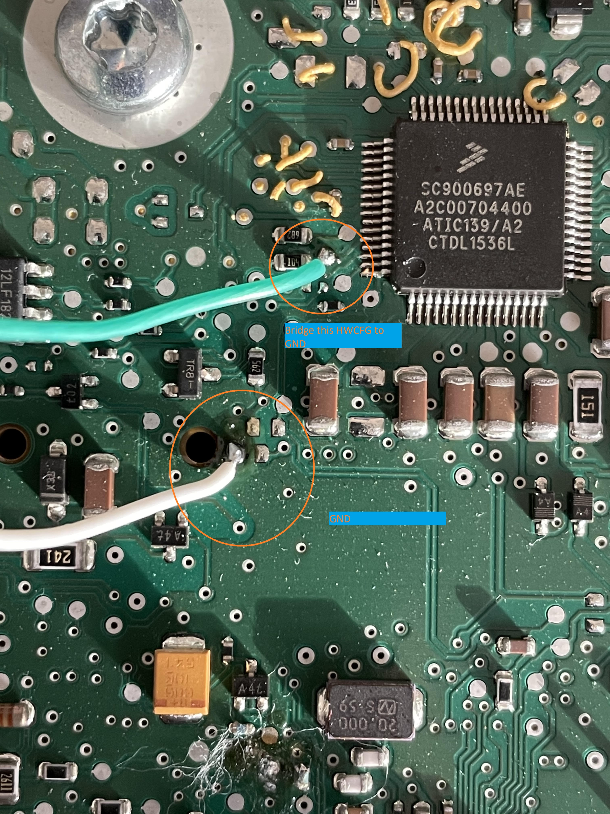

# TC1791_CAN_BSL
CAN Bootstrap Loader (BSL) for Tricore AudoMAX (TC1791 and friends)

# Background
By setting the HWCFG register on Tricore processors to a specific value, the Mask ROM / Boot ROM in the CPU will enter a serial-based or CAN-based Bootstrap Loader.

On AudoMAX, this Bootstrap Loader copies bytes to the beginning of Scratchpad RAM (C0000000) and jumps directly to execution from SPRAM.

Unfortunately, when the BSL is invoked, flash memory is locked by the Tricore user passwords. A mechanism for extracting these passwords exists for various ECUs, including Simos18, but the mechanism exists so far only in commercial tools.

Such extraction is outside of the scope of this BSL code, which only intends to provide unlock/read/write/erase and arbitrary code execution primitives once the passwords are known. If the ECU is not locked by the Immobilizer and is functioning correctly, Simos18 boot passwords can be extracted using the "Write Without Erase" exploit documented [here](https://github.com/bri3d/VW_Flash/blob/master/docs.md) combined with a simple arbitrary read primitive attached to a CAN handler. The passwords are located at 0x8001420C in the OTP area of flash.

# Documentation

Perform these PCB modifications to a Simos18 main board to enter the BSL. A few notes:

* The yellow goo isn't bodge wires or something, it's potting sealant from the other side of the PCB that's been pushed through the vias. If you find it ugly it is easy to remove.
* To open the ECU is very easy. It's held together with a few bent metal tabs and black RTV sealant. Simply bend the metal tabs away and cut through the black RTV sealant and the cover will lift right off. To reinstall is just the opposite.
* If you have a nicer setup with pogo pins and pullup / pulldown capability, you're in luck!
* Nothing is timing critical so a jig with programmable GPIO isn't necessary. You can just touch the last config pin to ground by hand while you turn on power, if that's how you roll.

To communicate, connect the following: 

* + ~13V: Left harness connector pins 6, 50, 86 (6 is one of the large pins, the rest are small).
* GROUND: 1 (this is the upper-right large pin).
* CANH: 79
* CANL: 80

# Current tools:

* [bootloader.py](bootloader.py) : This tool uploads "bootloader.bin" into an ECU in Bootstrap Loader mode.
* [bootloader](Bootloader_2) : This directory contains a project intended for us with the HiTec Tricore Free Toolchain (GCC) wich will produce a bootstrap loader binary containing some basic command primitives. It uses the basic TriBoard TC1791 iRAM linker presets from HiTec, with the DRAM memory map adjusted to not clobber the boot-time device id stored at D0000000 to D000000C. CANBus primitives were generated using DaVe V2.
